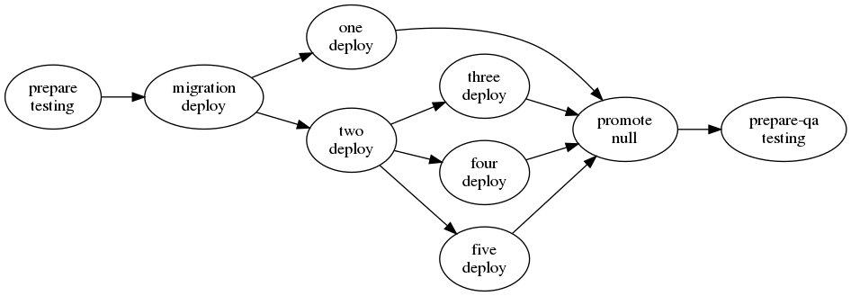

= GoCD Pipeline Code DSL in Kotlin
:toc: macro

[.float-group]
--
image::https://api.travis-ci.org/1and1/gocd-pico-dsl.svg?branch=master[Latest Travis build from master,link=https://travis-ci.org/1and1/gocd-pico-dsl, float=left]

image::https://img.shields.io/github/license/1and1/gocd-pico-dsl[gocd-pico-dsl License, link=LICENSE, float=left]

image::https://img.shields.io/maven-central/v/net.oneandone.gocd/gocd-pico-dsl[link=https://search.maven.org/artifact/net.oneandone.gocd/gocd-pico-dsl,float=left]
--

Generate GoCD pipelines for
link:https://github.com/tomzo/gocd-yaml-config-plugin[tomzo/gocd-yaml-config-plugin: Plugin to declare GoCD pipelines and environments configuration in YAML] in Kotlin DSL.

toc::[]

== Benefits

=== Typesafe DSL

- Code completion
- No typos

=== Remove boilerplate

- no need to define upstream pipelines, they are recognized by DSL structure
- group wrapper (`group("groupName") { ... }`) which sets the group in every contained pipeline

=== Validation
When writing the YAML configuration you can make many mistakes which only occur when you import the configuration in GoCD. With the validation you recognize errors earlier:

Check if pipeline has

- template or stage
- defined material or upstream pipeline
- a group defined

== Usage

=== Setup Kotlin project with GoCD DSL as dependency

[source,xml]
.pom.xml
----
<build>
    <sourceDirectory>src/main/kotlin</sourceDirectory>
    <testSourceDirectory>src/test/kotlin</testSourceDirectory>
    <plugins>
        <plugin>
            <groupId>org.jetbrains.kotlin</groupId>
            <artifactId>kotlin-maven-plugin</artifactId>
        </plugin>
    </plugins>
</build>
<dependencies>
    <dependency>
        <groupId>net.oneandone.gocd</groupId>
        <artifactId>gocd-pico-dsl</artifactId>
        <version>0.3.2</version>
    </dependency>
</dependencies>
----

=== Define DSL

Define your pipelines with DSL. Call in a main function `ConfigSuite(gocd, outputFolder = Paths.get(outputFolder)).writeFiles()` to start generation.

.net.oneandone.gocd.picodsl.examples.MinimalExample.kt
[source,java]
----
fun main(args: Array<String>) {
    val gocd = gocd {
        pipelines {
            sequence {
                group("dev") {
                    pipeline("deploy") {
                        materials {
                            repoPackage("myArtifact")
                        }
                        template = Template("deploy", "last-stage")
                    }
                }
            }
        }
    }

    val outputFolder = if (args.isNotEmpty()) args[0] else "target/gocd-config"
    ConfigSuite(gocd, outputFolder = Paths.get(outputFolder)).writeFiles()
}
----

=== Generate DSL

Call the main function above via maven:

[source,bash]
----
mvn compile exec:java -Dexec.mainClass="net.oneandone.gocd.picodsl.samples.MinimalExampleKt" -Dexec.args="target/gocd-config"
----

=== Configure Exec Plugin in pom.xml

Have a look at link:examples[examples] for a working maven example.

The following snippet shows two kinds how pipelines can be generated. Using the config registry and `net.oneandone.gocd.picodsl.GeneratePipelinesKt` should be easier.

[source,xml]
.examples/pom.xml
----
<plugin>
    <groupId>org.codehaus.mojo</groupId>
    <artifactId>exec-maven-plugin</artifactId>
    <version>1.6.0</version>
    <executions>
        <execution>
            <id>registry-starter</id>
            <phase>process-classes</phase>
            <goals>
                <goal>java</goal>
            </goals>
            <configuration>
                <!--ready to use starter which renders all registered pipelines -->
                <mainClass>net.oneandone.gocd.picodsl.GeneratePipelinesKt</mainClass>
                <arguments>
                    <!-- sourcePackage is required -->
                    <argument>--sourcePackage=net.oneandone.gocd.picodsl.examples.registry</argument>
                    <!-- other arguments are optional -->
                    <argument>--outputFolder=target/gocd-config</argument><!-- default: target/gocd-config -->
                    <argument>--plantuml</argument>
                    <argument>--dot</argument>
                </arguments>
            </configuration>
        </execution>
        <execution>
            <id>custom-starter</id>
            <phase>process-classes</phase>
            <goals>
                <goal>java</goal>
            </goals>
            <configuration>
                <!-- custom starter which calls ConfigSuite -->
                <mainClass>net.oneandone.gocd.picodsl.examples.MinimalExampleKt</mainClass>
            </configuration>
        </execution>
    </executions>
</plugin>
----

=== Using the registry

All objects which are derived from `RegisteredGocdConfig` are registered in `ConfigRegistry` and are automatically used by `net.oneandone.gocd.picodsl.GeneratePipelinesKt` if they are found in the defined base package.

[source,java]
.Second.kt
----
object Second : RegisteredGocdConfig({
    environments() {
        environment("devEnv") {}
    }
    pipelines {
        sequence {
            deploy("first") {
                group = "dev"
                materials {
                    repoPackage("euss")
                }
            }
        }
    }
})
----

=== Generate graphs

If you pass the `--dot` parameter a dot file is generated in the outputfolder. This can be converted with Graphviz to an image.:

[source,bash]
----
examples/target/gocd-config$ dot pipelines-first.dot -Tpng -o pipelines-first.png
----

The first line is the pipeline name, second the template name.

With `--plantuml` the same dot file is generated with a PlantUML wrapper:

[source]
----
@startuml
....
@enduml
----

So it can be easily viewed in IntelliJ if you have link:https://plugins.jetbrains.com/plugin/7017-plantuml-integration[PlantUML integration - plugin for IntelliJ IDEs | JetBrains] installed.

== Reference

Have a look at link:examples[examples] to see most elements.

=== Stubs

Stubs can help you if you already have existing pipelines and want to write a GoCD DSL which is based on them.
Stubs will not be rendered in the YAML, but are required as they are part of the materials of downstream pipelines.

[source,java]
----
stubPipeline("existing-pipeline") {
    template = Template("existing", "existing-stage")
}

pipeline("testing") {
    template = testing
}
----

== Writing you own Extensions (for advanced users)

GoCD DSL facilitates pipeline writing as much as possible for the generic use case. If you use GoCD in your company you will define best practices and standards.

You can reflect these standards in the DSL to maker you definition even shorter.

If you provide for deployment a "deploy" template, you can define your custom deploy pipeline:

[source,java]
----
val deployTemplate = Template("deploy", "deploy-stage")

fun PipelineGroup.deploy(name: String, block: PipelineSingle.() -> Unit = {}) {
    this.pipeline(name, block).apply {
        template = deployTemplate
        parameter("param1", "value1")
    }
}
----

This deploy extension function creates the pipeline as usual and afterwards sets the template and defines also a parameter which is required by the template.

[source,java]
.SecondUsingExtension.kt
----
pipelines {
    sequence {
        deploy("first") {
            group = "dev"
            materials {
                repoPackage("euss")
            }
        }
    }
}
----

For a better understanding see link:https://kotlinlang.org/docs/reference/extensions.html[Extensions - Kotlin Programming Language].

If you want to use your extension function in the group scope, you must add the extension function to every possible scope. This might look scary, but the pattern is always the same: Define extension functions for `PipelineGroup`, `SequenceContext`, `ParallelContext` andd delegate to a function which adds your custom functionality.

[source,java]
.PipelineExtensions.kt
----
fun PipelineGroup.deploy(
        name: String,
        block: PipelineSingle.() -> Unit = {}
) = deployPipeline(this, name, block)

fun SequenceContext.deploy(
        name: String,
        block: PipelineSingle.() -> Unit = {}
) = deployPipeline(this.pipelineGroup, name, block)

fun ParallelContext.deploy(
        name: String,
        block: PipelineSingle.() -> Unit = {}
) = deployPipeline(this.pipelineGroup, name, block)

private fun deployPipeline(pipelineGroup: PipelineGroup, name: String, block: PipelineSingle.() -> Unit) {
    pipelineGroup.pipeline(name, block).apply {
        template = deploy
        parameter("param1", "value1")
    }
}
----

For a better understanding why wee need to extend every scope have a look at Kotlin DSLs: link:https://kotlinlang.org/docs/reference/type-safe-builders.html#scope-control-dslmarker-since-11[Type-Safe Builders: Scope Control - Kotlin Programming Language].